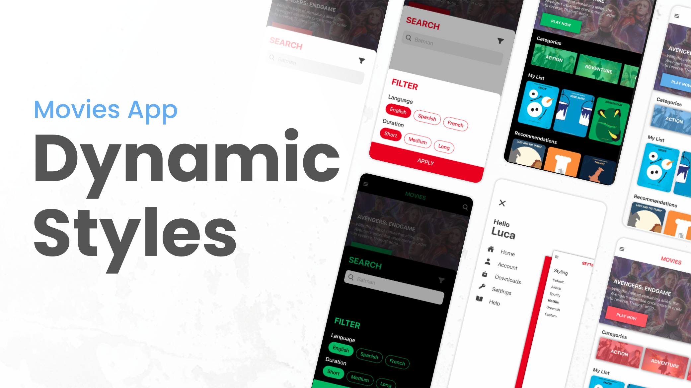

# Movies App API (Chameleon 🦎)

> This is an API for the [Nativescript Movies App]()

This API lets you transform the app into anything you come up with (hence then name Chameleon 🦎). The App is driven entirely by an external API for its contents and styling.

## Want to see the App in a different style?



Think about this like creating a skin or a theme. Get creative and add your own styles (maybe a neon one or grayscale, hmm 🧐).

Similar to how adding a content works, the app has an option to point to a custom url. You can fork this repo and point the app to your repo with the modified styles.

If you want your fancy new styles to show up in the list in the app, open a PR to this repo and add your styles in the [styles directory](./styles) and add your new css to the [`styles/styles.json`]().

## [In Progress] Want to see the App with a different content?

Maybe you want to transform the app into an ecommerce app that sells furniture? or maybe a sporting goods app?

You can do all that by modifying the files in the [data directory](./data).

The app has an option to point to a custom url. You can fork this repo and point the app to your repo

If you want your content to show up in the list of contents in the app, open a PR to this repo and add your new content in the [`data/data.json`]().

## How it works?

The app makes a `GET` request to the raw file on github to get the dynamic styles/data.

### Styles

The app is configured to use utility classes for its styling (similar to TailWind) using CSS variables. This allows the app to be styled easily by modifying the CSS variables.

To use the CSS from the `GET` request, the app parses the CSS variables and updates the app's CSS file with the new variables from the API.

## Some quirks about the URL

Since the app makes a `GET` request to github, we would need to use the `raw` url instead of the regular file url.

```
// this works
https://raw.githubusercontent.com/williamjuan027/movies-app-api/main/styles/default.css

// this wouldn't work
https://github.com/williamjuan027/movies-app-api/blob/main/styles/default.css
```
